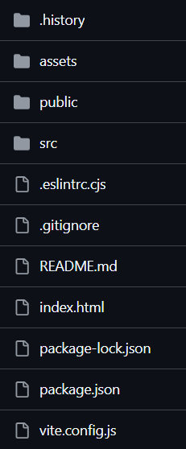

# My Portfolio Website

Welcome to my online portfolio! 🌐💻  

A modern and responsive portfolio to showcase projects, skills, and experiences. Designed for performance, accessibility, and a seamless user experience.  
 
 ---

## 📸 Preview  
### Homepage  

This portfolio includes various sections like:
- A personal introduction and professional background
- A collection of projects and achievements
- An easy-to-navigate layout
  
  

### Project Structure 
The project follows a clean and modular structure to ensure scalability and ease of maintenance:

  

---

## 🚀 Technologies & Skills  

This portfolio is built using the following technologies and tools:

- **Frontend:** 
  - HTML, CSS, JavaScript, React.js  
  - Responsive design for mobile-first experience
- **Design:** 
  - Figma for wireframing and prototyping [View Figma Design](https://www.figma.com/design/vjlUz3St5l6a5yp7LK0wuX/Portfolio?node-id=34-871&t=YHIgNufOtI7PXsTX-0)
  - Styled Components for CSS-in-JS styling
  
- **Version Control:**
  - Git & GitHub for code versioning and collaboration
- **Deployment:** 
  - Vercel for hosting and continuous deployment

